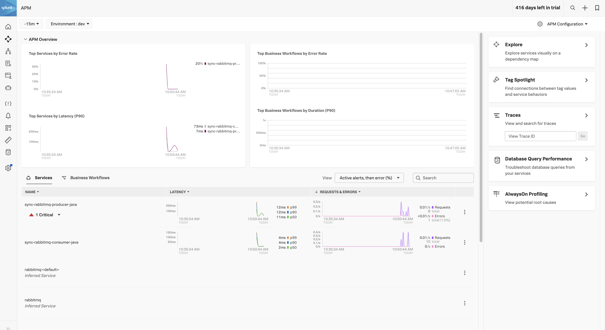
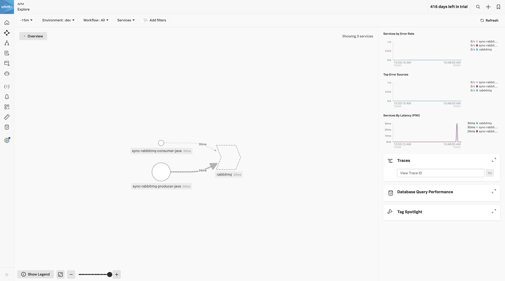
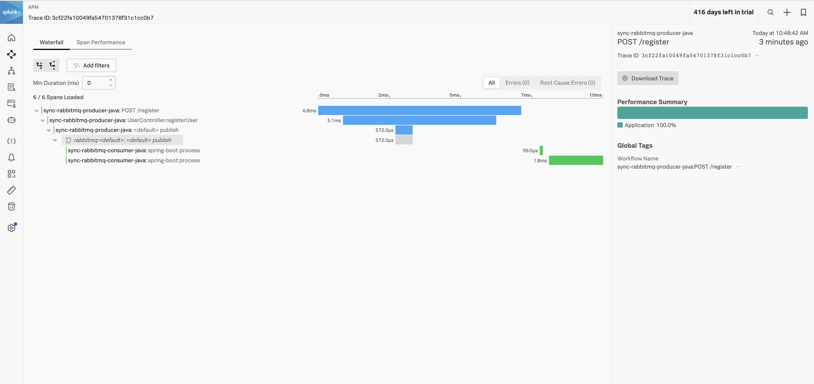
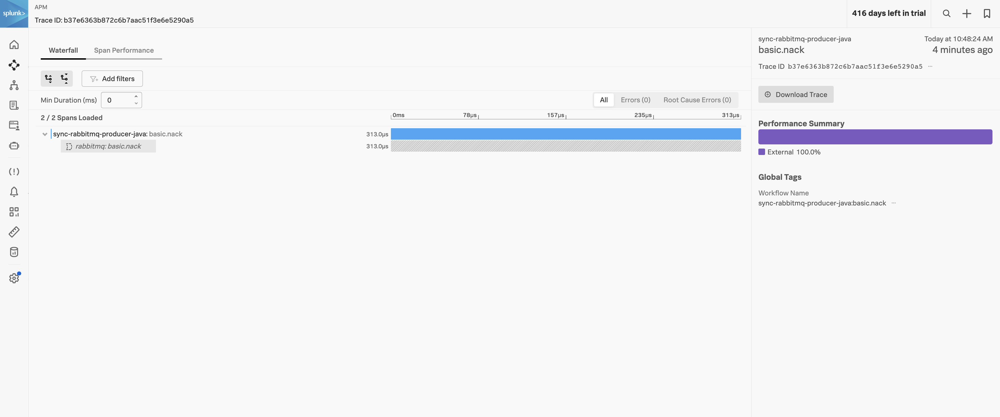

# Synchronous RabbitMQ OpenTelemetry

Objective of this repository is to understand how Spring boot + RabbitMQ traces behavior when sent into the Splunk O11y.

The repository is cloned from this [article](https://blog.tericcabrel.com/spring-boot-applications-rabbitmq/)

## Pre-Requisite

Maven and Java compiler version.

```bash
➜  splunk-otel-sync-rabbitmq mvn --version
Apache Maven 3.8.6 (84538c9988a25aec085021c365c560670ad80f63)
Maven home: /usr/local/Cellar/maven/3.8.6/libexec
Java version: 18.0.2.1, vendor: Homebrew, runtime: /usr/local/Cellar/openjdk/18.0.2.1/libexec/openjdk.jdk/Contents/Home
Default locale: en_GB, platform encoding: UTF-8
OS name: "mac os x", version: "13.5.1", arch: "x86_64", family: "mac"

➜  splunk-otel-sync-rabbitmq java --version
openjdk 19.0.1 2022-10-18
OpenJDK Runtime Environment (build 19.0.1+10-21)
OpenJDK 64-Bit Server VM (build 19.0.1+10-21, mixed mode, sharing)

```


## To Run

1. Run the OTEL collector in the background.
2. Build both the modules with `mvn clean package`
3. Start RabbitMQ docker

```bash
docker run -it --rm --name rabbitmq -p 5672:5672 -p 15672:15672 rabbitmq:3.9-management
```

4. Start the publisher with the `start-publisher.sh` script
5. Start the consumer with the `start-consumer.sh` script
6. POST payload the publisher endpoint `http://localhost:8001/register`

```json
{
    "name" : "{{$guid}}",
    "email": "tester@test.com"
}
```

7. Consumer will consume the payload

```bash
Message received - UserRegisteredPayload[fullName=c410be41-af31-4e36-a212-a48ed3d25435, emailAddress=tester@test.com, confirmationCode=115631]
User full name:    c410be41-af31-4e36-a212-a48ed3d25435
Email Address:     tester@test.com
Confirmation code: 115631
```

## Splunk O11y APM





Publish Trace Flow `a4513a9fc4c26ec39f0e97b4b5dbddb0`


Consume Trace Flow `2bdba58c59bec10d86e1ad6dad308919`

